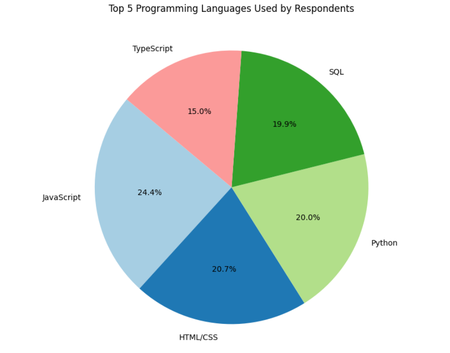
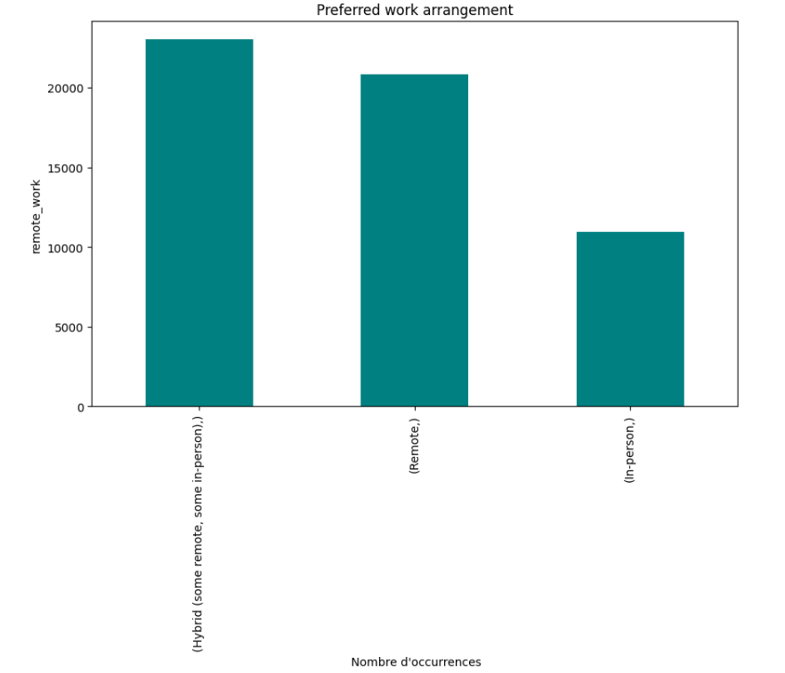

# 🧠 Technology Trends & Insights: Coding, Databases, and Cloud Utilization

---

## 💼 Business Problem

In the rapidly evolving tech industry, staying informed about current and emerging technology trends is crucial for both software developers and companies. Many organizations struggle to anticipate which programming languages, databases, and platforms will dominate, while developers risk focusing on skills that may become outdated. This project addresses the need for trend awareness by analyzing a large developer survey to uncover insights into what tools and technologies are popular now and gaining momentum for the future. These insights aim to help businesses make strategic decisions on tech adoption and guide developers in honing the right skills for career growth.

---

## 🗂️ Dataset Summary

The analysis is based on the **2024 Stack Overflow Developer Survey**, which includes responses from **65,457 developers** across **114 questions**. This dataset offers a comprehensive snapshot of global developer preferences and behaviors, covering topics such as:

- 🧑‍💻 Programming languages
- 🗄️ Databases
- ☁️ Cloud platforms
- 🏢 Work environments

Data was collected using a combination of Stack Overflow’s **public API** and **targeted web scraping** to ensure broad and relevant coverage. After acquisition, the dataset underwent rigorous cleaning:

- ✅ Duplicate entries were removed  
- 🔧 Missing values were handled (via imputation or exclusion)  
- 🧹 Categorical fields were normalized for consistency

These steps produced a **high-quality, analysis-ready dataset** that supports meaningful exploration of trends in software development across various roles and technologies.

### 📎 Dataset Source

The dataset is released under the **Open Database License (ODbL)** and is publicly available here:  
🔗 [2024 Stack Overflow Developer Survey](https://stackoverflow.blog/2024/08/06/2024-developer-survey/)

---

## 🔬 Methodology

The project followed a structured approach to gather and analyze the data:

**Data Collection via APIs**: Relevant data was retrieved using public APIs. For example, external job posting data was collected to complement the survey, providing context on which skills are in demand. This helped tie the survey insights to real-world job market trends.

**Web Scraping**: Additional information was gathered through web scraping. Key websites and forums were scraped for technology trend indicators (such as the popularity of certain frameworks or cloud services), to enrich the analysis beyond the core survey responses.

**Data Wrangling**: The raw data was thoroughly cleaned and prepared. This included finding and removing duplicate responses, handling missing values (using techniques like imputation or interpolation where possible), and normalizing data (e.g., standardizing text casing, consolidating categories) to ensure consistency. These steps improved data quality and reliability for analysis.

**Exploratory Data Analysis (EDA)**: With clean data, an in-depth EDA was conducted. The distribution of responses for key questions was analyzed to understand common patterns (for instance, most-used languages or typical database choices). Outliers were identified (e.g., unusually high experience years) to see if they affected overall trends. The relationships between variables were also examined, such as correlating preferred languages with developer age or job role, to uncover any interesting associations.

**Visualization**: Insights from the EDA were visualized using Python libraries like Matplotlib and Seaborn. Multiple chart types (histograms, box plots, bar charts, pie charts, etc.) were created to illustrate findings – for example, bar charts for top programming languages and databases, and pie charts for remote vs in-office work distribution. These static visualizations helped confirm trends and made it easier to communicate results.

**Dashboard Development**: Finally, an interactive dashboard was built using Looker Studio. This dashboard consolidates the key charts and findings, allowing stakeholders to explore the data dynamically. It includes filters and tabs – for instance, one can view programming language popularity, database usage, or work preference distribution on separate tabs. This interactive tool enables decision-makers to slice the data (e.g., by region or experience level) for deeper insight, supporting technology trend awareness in an accessible format.

---

## 🛠️ Tools Used

Tools and technologies utilized in this project:

The project made use of a range of tools to accomplish its goals. Microsoft Excel was used for initial data inspection and simple cleaning tasks, especially to get a quick overview of the dataset structure. SQL (Structured Query Language) was employed to run queries on the data – for example, to filter survey responses or join supplementary datasets (like combining survey results with job demand data). The core of the analysis was done in Python, using libraries such as pandas for data manipulation and cleaning, and Matplotlib/Seaborn for creating charts and visualizations. Finally, IBM Cognos Analytics and Looker Studio was used to design an interactive dashboard, where charts (such as bar graphs of tool usage, language popularity, and remote work distribution) were assembled into a cohesive interactive report. Each tool played a role: Excel and SQL for data handling, Python for in-depth analysis and visualization, and Looker Studio for sharing results in an interactive, business-friendly manner.

---

## 📊 Results Summary

### 🧑‍💻 Programming Language Trends

**Top Programming Languages:** JavaScript, HTML/CSS, SQL, and Python are the most widely used languages among developers. JavaScript continues to dominate as the most used programming language, with roughly 62% of respondents using it in the past year. Following JavaScript, the next most common technologies are HTML/CSS, SQL, and Python, each of which also have a large share of users in the developer community.

This indicates that web development languages (JavaScript, HTML/CSS), as well as data-related languages (SQL and Python), remain highly prevalent. The chart above shows the top languages developers have worked with. Notably, newer languages like TypeScript also rank high in usage, reflecting the industry’s adoption of modern JavaScript variants. In contrast, traditional languages such as Java and C# have a solid but comparatively smaller share. These usage patterns underscore the continuation of long-term trends: JavaScript’s ubiquity in web development, SQL and Python’s importance in data and backend work, and the growing popularity of TypeScript for large-scale JavaScript projects.

---

### 🏠 Remote Work Trends

**Work Arrangement Distribution:** Hybrid and fully-remote work arrangements have become the norm for developers. According to the survey data, a significant portion of developers work in flexible setups. Approximately 50% of developers are in a hybrid work model (splitting time between office and remote), and around 30–38% work fully remote. This leaves only roughly 20% of respondents working exclusively in-person/on-site, a share that has been gradually shrinking.

The bar chart above illustrates this distribution of work preferences. The trend is clear – the majority of developers have embraced remote work at least part of the time. This shift toward remote and hybrid work reflects the wider industry trend accelerated by recent years, where flexibility and work-life balance are highly valued. For companies, this means that offering remote work options can be key to attracting and retaining developer talent. Meanwhile, developers have more opportunities than ever to work for companies around the world without relocating, thanks to the acceptance of remote collaboration tools and practices.

---

## 💡 Top Business Insights

From the analysis, several key insights emerged that have important implications for technology strategy and decision-making:

- **Established languages remain dominant:** Established programming languages continue to hold their ground. JavaScript, Python, and SQL are at the forefront of usage across the industry, confirming that these skills are as critical as ever for developers and teams. Companies relying on these technologies can be confident in their relevance, and developers proficient in these areas remain in high demand.

- **Rising interest in emerging languages:** Some newer languages and technologies show a disproportionately high interest relative to their current usage. For example, Rust and Go have far more developers wanting to work with them than those currently using them. In our data, Rust’s future interest was about six times its current usage, and Go showed a similar trend. This indicates that these languages are seen as up-and-coming, valued for their performance and modern features.  
  **Insight:** Businesses should watch these emerging languages – even if Rust and Go have smaller user bases now, they boast strong communities and could become mainstream as more projects adopt them. Developers are clearly betting on their future importance.

- **PostgreSQL leads the database landscape:** Among databases, PostgreSQL has become the most popular choice, used by roughly half of the surveyed developers. This marks a shift in the database domain, as PostgreSQL’s popularity has grown steadily (overtaking traditional databases like MySQL in many contexts). Additionally, there is growing interest in next-generation and cloud-native databases. Tools like Redis (an in-memory data store) and Supabase (a backend as a service built on PostgreSQL) are rising in profile, even if their current usage is not as widespread.  
  **Insight:** Organizations are increasingly favoring open-source and scalable database solutions.

- **Cloud platforms are nearly ubiquitous:** Cloud computing has firmly established itself in the development workflow. A strong shift toward cloud platforms is evident, with Amazon Web Services (AWS) being the leading choice for developers, and Google Cloud Platform (GCP) also growing in adoption.  
  **Insight:** Businesses should continue to invest in cloud expertise and infrastructure. AWS’s dominance means a lot of tooling and knowledge is centered there, but multi-cloud skills (including GCP and others like Azure or DigitalOcean) are valuable.

- **Remote/hybrid work is the new norm:** The survey reinforces that remote work is not a temporary phenomenon but a lasting change in how development teams operate. Over 80% of developers work remotely at least part of the week, with a majority in hybrid arrangements and a significant portion fully remote.  
  **Insight:** To remain competitive and attract top talent, companies should adapt their policies to support remote and hybrid work.

---

## 🎯 Strategic Recommendations

### 👩‍💻 Developers
Continue mastering core technologies like JavaScript, Python, and SQL. Invest in learning emerging languages such as Rust and Go. Deepen your cloud skills, starting with AWS and expanding to GCP.

### 🏢 Businesses
Modernize your stack with trends in mind. Embrace PostgreSQL and experiment with Redis. Offer hybrid/remote work and support professional development to retain top talent.

### 🎓 Educators & Trainers
Update programs to reflect real industry demand: hands-on with SQL, Python, JavaScript, cloud basics, and introduce Rust and Go. Emphasize remote collaboration tools like Git/GitHub.

---

**Overall**, _Technology Trends & Insights_ provides valuable guidance. Developers can steer their learning pathways, businesses can shape their tech adoption roadmaps, and educators can tailor their programs – all informed by real data on what’s popular now and what’s coming next. By taking these recommendations on board, stakeholders will be better prepared to innovate and excel in the fast-moving world of technology.

## 📊 Dashboard

You can explore the interactive dashboard prepared as part of this project. It summarizes the key insights using visualizations and clean layouts.

## 📬 Contact

If you'd like to connect or discuss this project:

- 📧 Email: [abdouhall58@gmail.com](mailto:abdouhall58@gmail.com)  
- 💼 LinkedIn:

  

